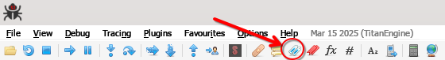

I used bindiff and binexport to associate symbols from RBXGS to the equivalent roblox version, and made it compatible with x32dbg.

grab the latest zip of binaries from the lessmsi repo:
<https://github.com/activescott/lessmsi/releases>
and then run this on your RBXGS version of choice:
```
lessmsi x RBXGS_MSI_NAME.msi
```
This will extract the msi, which you can find WebService.dll in.

The instructions for binexport via ghidra should be fairly straightforward, you'll just need to analyze both Roblox.exe and WebService.dll with it's pdb.<br />
<https://github.com/google/binexport><br />
**It's highly recommended to leave these binaries in their original folders, and to just drag them into ghidra.**

Then run this with <https://github.com/google/bindiff>:
```
bindiff --primary=CLIENT_FILENAME.BinExport --secondary=RBXGS_FILENAME.BinExport
```
**Order of arguments in bindiff is important, roblox first, then rbxgs.**

bindiff will then create an sqlite3 database file, which we can parse into a x32dbg database file with labels, which I've done here with this python script.

The latest ghidra is broken with binexport, you'll need this one until binexport gets updated:
<https://github.com/NationalSecurityAgency/ghidra/releases/tag/Ghidra_11.3.1_build>

**bindiff generates a confidence level for function matches, this completely ignores low confidence levels, meaning some functions might get incorrect names. Your mileage may vary.**

In order to use this, import it into your x32dbg under the file menu, then click this:

